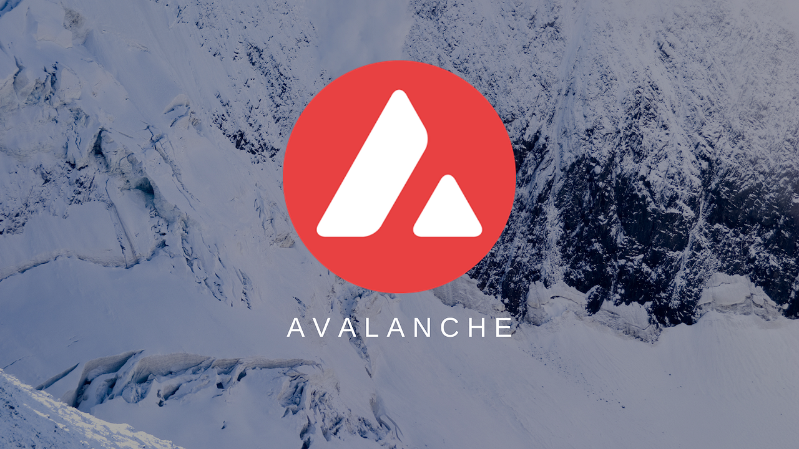
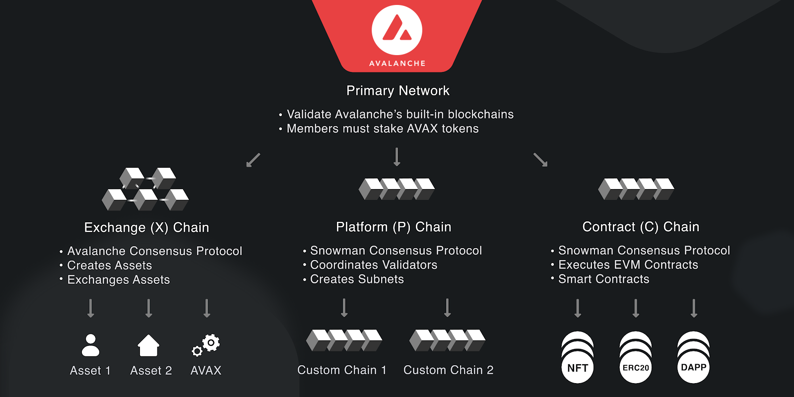

# AVAX

# What is AVAX?

Avalanche (AVAX) is a cryptocurrency and blockchain platform that rivals Ethereum. AVAX is the native token of the Avalanche blockchain, which—like Ethereum—uses smart contracts to support a variety of blockchain projects. Avalanche can provide near-instant transaction finality. AVAX is also used to pay transaction processing fees and secure the Avalanche network, and acts as a basic unit of account with other blockchains in the Avalanche ecosystem.

----------------------------------------------------------------------

# Understanding AVAX
Avalanche's smart contracts platform supports both [decentralized applications (dapps)](https://support.avax.network/en/articles/4587146-what-is-a-decentralized-application-dapp) and autonomous blockchains. These are some of the features that make Avalanche unique:

### Speed
* Uses a novel consensus protocol, developed by a team of Cornell computer scientists, and is able to permanently confirm transactions in under 1 second.

### Scalability
* Capable of 4,500 transactions per second–an order of magnitude greater than existing blockchains.

### Security
* Ensures stronger security guarantees well-above the 51% standard of other networks.

### Flexibility
* Easily create custom blockchains and decentralized apps that contain almost any arbitrary logic.

### Sustainability
* Uses energy-efficient proof-of-stake consensus algorithm rather than proof-of-work.

### Smart Contract Support
* Supports the creation of Solidity smart contracts and your favorite Ethereum tools like Remix, Metamask, Truffle, and more.

### Private and Public Blockchains
* Create your own public or private blockchains.

### Designed for Finance
* Native support for easily creating and trading digital smart assets with complex, custom rulesets.

------------------------------------------------------------------------

# Avalanche Consensus Protocol

Avalanche is a DAG-optimized consensus protocol–high-throughput, parallelizable, and simple to prune.

------------------------------------------------------------------------

## Differences Between Avalanche C-Chain and Ethereum

### Atomic Transactions

As a network composed of multiple blockchains, Avalanche uses *atomic transactions* to move assets between chains. Coreth modifies the Ethereum block format by adding an *ExtraData* field, which contains the atomic transactions.

### Tokens on the C-Chain

## AVAX

AVAX plays the same role on the C-Chain that ETH does on the Ethereum Network. When you create or call a smart contract, you pay the transaction fee (gas cost) with AVAX. You can transfer AVAX between accounts and send AVAX to a smart contract using native EVM tools and libraries.

### Avalanche Native Tokens (ANTs)

The C-Chain supports Avalanche Native Tokens, which are created on the X-Chain using precompiled contracts. These precompiled contracts *nativeAssetCall* and *nativeAssetBalance* support the same interface for ANTs as *CALL* and *BALANCE* do for AVAX with the added parameter of *assetID* to specify the asset.

For the full documentation of precompiles for interacting with ANTs and using them in ARC-20s, see [here](https://docs.avax.network/build/references/coreth-arc20s).

### Block Timing

Blocks are produced asynchronously in Snowman Consensus, so the timing assumptions that apply to Ethereum do not apply to Coreth. To support block production in an async environment, a block is permitted to have the same timestamp as its parent. Since there is no general assumption that a block will be produced every 10 seconds, smart contracts built on Avalanche should use the block timestamp instead of the block number for their timing assumptions.

A block with a timestamp more than 10 seconds in the future will not be considered valid. However, a block with a timestamp more than 10 seconds in the past will still be considered valid as long as its timestamp is greater than or equal to the timestamp of its parent block.

-------------------------------------------------------------------------

## Staking on Avalanche

Staking is a natural mechanism for participation in an open network and offers a direct economic argument: the probability of success of an attack is directly proportional to a well-defined monetary cost function. Staking nodes are economically motivated to act virtuously and avoid behavior that might hurt the value of their stake.

A node wishing to enter the network can freely do so by first putting up and locking a stake that cannot be moved for a defined period of time determined by the token holder. Once accepted, a stake cannot be reverted or unlocked to ensure that nodes share the same, stable view of the network. And better yet, for both the token holder and the network, is that this stake does not incur any additional upkeep costs.

Unlike other systems that also propose a proof-of-stake (PoS) mechanism, AVAX does not use slashing, and therefore, all stake is returned when the staking period expires.

Slashing is a protocol-driven action where a validator is forced to forfeit a proportion of its staked tokens because of behavior the network reads as dishonest or malfunctioning. These penalties are imposed without any human intervention and can be carried out for something as honest as a power failure taking a node offline.

There’s been significant debate around slashing, but the reality is that it makes staking unpredictable (which could discourage participation) and is more effective at punishing innocent bugs in client software or hardware than any security assurances.

Avalanche believes in building a “calm technology” that is powerful, but predictable. A technology engineered for the challenges of the real-world, rather than overconfident in its adherence to perfect conditions.

With Avalanche, staked tokens are never at risk of a faulty network crackdown.

--------------------------------------------------------------------------

## Staking Parameters on Avalanche
When a validator is done validating the [Primary Network](https://support.avax.network/en/articles/4135650-what-is-the-primary-network), it receives back the AVAX tokens it staked. It may receive a reward for helping to secure the network. A validator only receives a [validation reward](https://support.avax.network/en/articles/4587396-what-are-validator-staking-rewards) if it is sufficiently responsive and correct during the time it validates. Read the Avalanche token [whitepaper](https://www.avalabs.org/whitepapers) to learn more about AVAX and the mechanics of staking.

# Warning
`Staking rewards are sent to your wallet address at the end of the staking term as long as all of these parameters are met`.

---------------------------------------------------------------------------

## Subnets

Avalanche features 3 built-in blockchains: Exchange Chain (X-Chain), Platform Chain (P-Chain), and Contract Chain (C-Chain). All 3 blockchains are [validated](https://support.avax.network/en/articles/4064704-what-is-a-blockchain-validator) and secured by the [Primary Network](https://support.avax.network/en/articles/4135650-what-is-the-primary-network). The Primary Network is a special subnet, and all members of all custom subnets must also be a member of the Primary Network by staking at least 2,000 AVAX.

--------------------------------------------------------------------------

## Subnets Continued

A subnet, or subnetwork, is a dynamic set of validators working together to achieve consensus on the state of a set of blockchains. Each blockchain is validated by exactly one subnet. A subnet can validate many blockchains. A node may be a member of many subnets.

A subnet manages its own membership, and it may require that its constituent validators have certain properties. This is very useful, and we explore its ramifications in more depth below:

Compliance
Avalanche’s subnet architecture makes regulatory compliance manageable. As mentioned above, a subnet may require validators to meet a set of requirements.

Some examples of requirements include:

* Validators must be located in a given country
* Validators must pass a KYC/AML checks
* Validators must hold a certain license

### Support for Private Blockchains

You can create a subnet where only certain pre-defined validators may join and create a private subnet where the contents of the blockchains would be visible only to those validators. This is ideal for organizations interested in keeping their information private.

### Separation of Concerns

In a heterogeneous network of blockchains, some validators will not want to validate certain blockchains because they simply have no interest in those blockchains. The subnet model allows validators to only concern themselves with blockchains that they care about. This reduces the burden on validators.

### Application-Specific Requirements

Different blockchain-based applications may require validators to have certain properties. Suppose there is an application that requires large amounts of RAM or CPU power. A Subnet could require that validators meet certain hardware requirements so that the application doesn’t suffer from low performance due to slow validators.

## Virtual Machines
A Virtual Machine (VM) defines the application-level logic of a blockchain. In technical terms, it specifies the blockchain’s state, state transition function, transactions, and the API through which users can interact with the blockchain. Every blockchain on Avalanche is an instance of a VM.

When you write a VM, you don't need to concern yourself with lower-level logic like networking, consensus, and the structure of the blockchain. Avalanche does this behind the scenes so you can focus on the thing you would like to build.

Think of a VM as a blueprint for a blockchain; you can use the same VM to create many blockchains, each of which follows the same ruleset but is logically independent of other blockchains.

### Why Virtual Machines?

At first, blockchain networks had one Virtual Machine (VM) with a pre-defined, static set of functionality. This rigid, monolithic design limited what blockchain-based applications one could run on such networks.

People who wanted custom decentralized applications had to create their own, entirely new blockchain network from scratch. Doing so required a great deal of time and effort, offered limited security, and generally resulted in a bespoke, fragile blockchain that never got off the ground.

Ethereum made a step toward solving this problem with smart contracts. Developers didn’t need to worry about networking and consensus, but creating decentralized applications was still hard. The Ethereum VM has low performance and imposes restrictions on smart contract developers. Solidity and the other few languages for writing Ethereum smart contracts are unfamiliar to most programmers.

Avalanche VMs (AVMs) make it easy to define a blockchain-based decentralized application. Rather than new, limited languages like Solidity, developers can write VMs in Go (other languages will be supported in the future).

## Creating Your Blockchain and Virtual Machine

Avalanche supports the creation of new instances of the Avalanche VM.

* [Create an EVM Subnet on Local](https://docs.avax.network/subnets/create-a-local-subnet)

* [Create an EVM Subnet on Fuji Testnet](https://docs.avax.network/subnets/create-a-fuji-subnet)

Avalanche also supports creating custom blockchains with virtual machines.

* [ Create a Virtual machine (VM)](https://docs.avax.network/subnets/create-a-virtual-machine-vm)

* [Create a Custom Blockchain](https://docs.avax.network/subnets/create-custom-blockchain)

