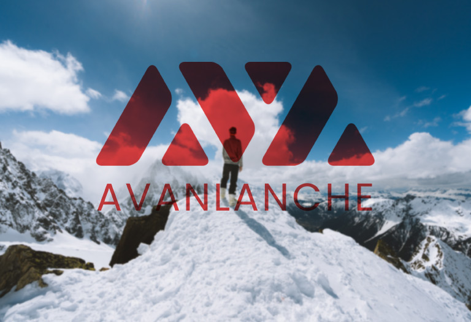

# AVAX

# What is AVAX?

Avalanche (AVAX) is a cryptocurrency and blockchain platform that rivals Ethereum. AVAX is the native token of the Avalanche blockchain, which—like Ethereum—uses smart contracts to support a variety of blockchain projects. Avalanche can provide near-instant transaction finality. AVAX is also used to pay transaction processing fees and secure the Avalanche network, and acts as a basic unit of account with other blockchains in the Avalanche ecosystem.
----------------------------------------------------------------------

# Understanding AVAX
Avalanche's smart contracts platform supports both [decentralized applications (dapps)](https://support.avax.network/en/articles/4587146-what-is-a-decentralized-application-dapp) and autonomous blockchains. These are some of the features that make Avalanche unique:

### Speed
**Uses a novel consensus protocol, developed by a team of Cornell computer scientists, and is able to permanently confirm transactions in under 1 second.

Scalability
Capable of 4,500 transactions per second–an order of magnitude greater than existing blockchains.

Security
Ensures stronger security guarantees well-above the 51% standard of other networks.

Flexibility
Easily create custom blockchains and decentralized apps that contain almost any arbitrary logic.

Sustainability
Uses energy-efficient proof-of-stake consensus algorithm rather than proof-of-work.

Smart Contract Support
Supports the creation of Solidity smart contracts and your favorite Ethereum tools like Remix, Metamask, Truffle, and more.

Private and Public Blockchains
Create your own public or private blockchains.

Designed for Finance
