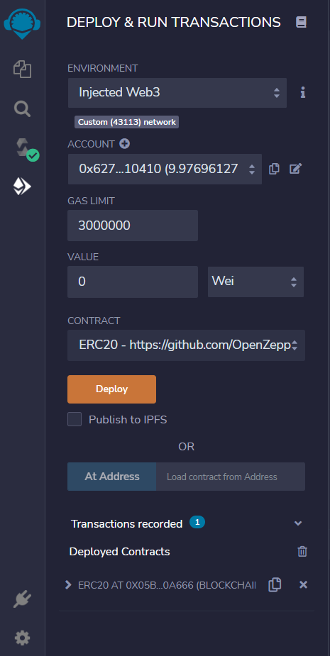
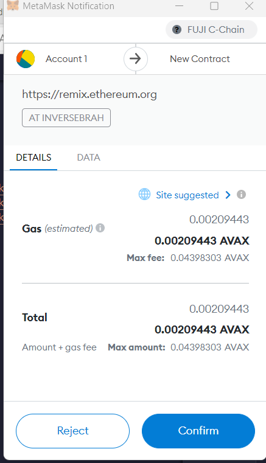

# Snow Token

A fresh coating of snow tends to beautify just about any city, but some snowy destinations become truly magical during the chillier months of the year, bringing a quieting sense of calm, with the hushed sound of flakes falling along with that glistening sparkle of white. This for many is a spectacular beauty. From Siglufjordur Iceland, Cesky Krumlov Czech Republic, Rothenburg Germany & Montreal, Canada, these places thrive in the fridiged cold. But what type of currency are they using? They are using the SnowToken. 

The SnowToken is built off of Avalanche and its battled tested consenses algorithem Direct Acyclic Graph (DAG). AVAX is faster, cheaper, scaleable & more secure. The communities wanted to go with AVAX because of those reasons. Built for the cold and to weather the fridiged winter storms. The SnowToken is resilant and scaleable just like the people living in the frozen tundras. The SnowToken will be a fungible token that’s ERC-20 compliant. I have launched a crowdsale that will allow people who are moving to the coldest parts of the world to convert their fiat dollars to the SnowToken.

--------------------------------------------------------

## Understanding the Contract

#### The Process

* Create the SnowToken Token Contract

* Create the SnowToken Crowdsale Contract

* Create the SnowToken Deployer Contract

* Deploy and Test the Crowdsale on a Local Blockchain

* Extended the Crowdsale Contract by Using OpenZeppelin

----------------------------------------------------------

## Fuji RPC (AVAX Testnet)

After I created the smart contract, I tested the contract out on the Fuji testnet:

* Network Name: Avalanche Fuji Testnet
* New RPC URL: https://api.avax-test.network/ext/bc/C/rpc
* Chain ID: 43113
* Symbol: AVAX
* Block Explorer URL: https://testnet.snowtrace.io/

----------------------------------------------------------

## Execution Results

Next I ran the smart contract and connected my metamask wallet to the contract using the `Inject Web3` environment to test the contract out.

-----------------------------------------------------------

## Metamask Configuration

When connected to "Injected Web3" I got a response form my metamask wallet which brought up my wallet & ballance to be able to run the smart contract. Before I could launch the contract, I needed some test AVAX from the faucet:

Testnet faucet [AVAX Testnet Faucet](https://faucet.avax-test.network/)

------------------------------------------------------------

